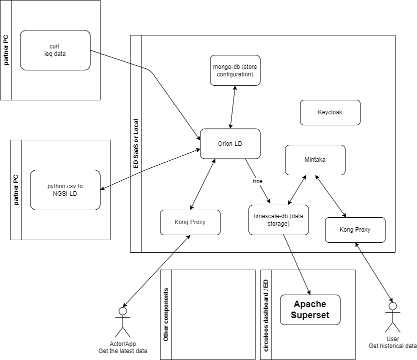
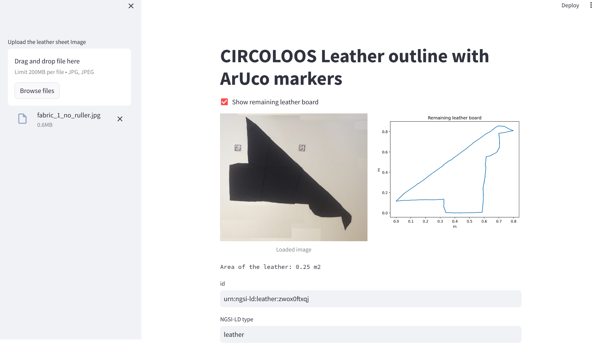
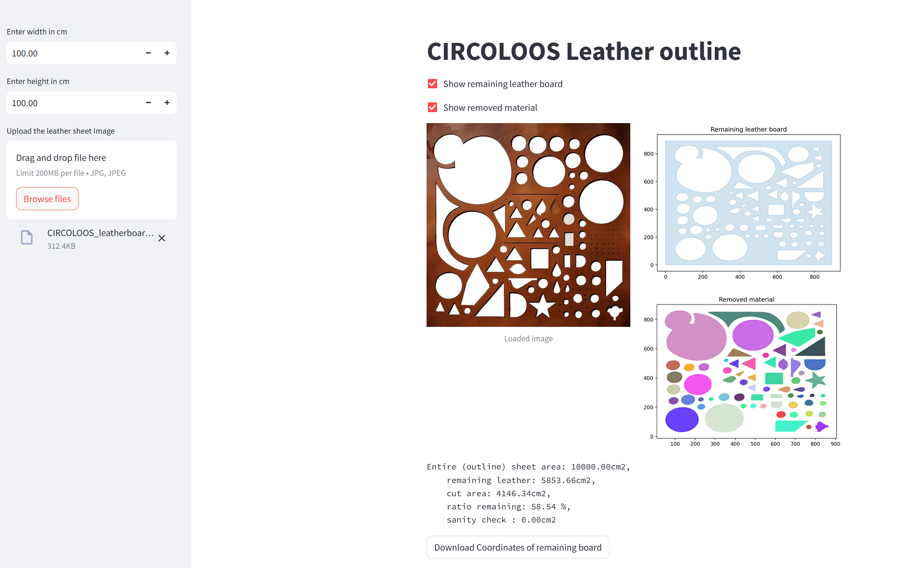

# CIRCULOOS Platform
The CIRCULOOS Platform utilizes FIWARE components, designed to be implemented on factory premises or on the cloud. It compatible with the [NGSI-LD](https://www.etsi.org/deliver/etsi_gs/CIM/001_099/009/01.07.01_60/gs_cim009v010701p.pdf) (Next Generation Service Interfaces) specifications. This platform setup serves as a template, equipped with minimal configurations to facilitate a smooth startup. Utilizing [FIWARE generic enablers](https://github.com/FIWARE/catalogue). 

## Architecture 
The main components of the circuloos IoT LD platform are:

1. **[Orion-LD](https://github.com/FIWARE/context.Orion-LD)**
   - Role: Context Broker for NGSI-LD entity management
   - Function: Real-time data storage and retrieval

2. **[Mintaka](https://github.com/FIWARE/mintaka)**
   - Role: NGSI-LD temporal retrieval API
   - Function: Historical data queries and time-series analysis
   - Documentation: [OpenAPI Specifications](./commands_URL/miktakaOpenAPISpecs.yaml)

3. **[Keycloak](https://www.keycloak.org/)**
   - Role: Identity and Access Management (IAM)
   - Function: Single sign-on authentication and authorization

4. **[Kong](https://github.com/FIWARE/kong-plugins-fiware)** as API Proxy
   - Role: Policy Enforcement Point (PEP) proxy
   - Function: API gateway for Orion-LD and Mintaka access control



## Data Models

The CIRCULOOS platform leverages standardized data models to enhance interoperability and consistency across the ecosystem.

### Standard Data Models
We adhere to [Smart Data Models](https://smartdatamodels.org/), a global initiative that provides open-licensed, standardized data models for various domains, including Smart Cities, Smart AgriFood, Smart Manufacturing, and more. These models facilitate seamless data exchange and integration between different systems.

### CIRCULOOS Specific Models
To address the specific needs of the circular economy in manufacturing, we have developed the [CIRCULOOS Data Model](https://github.com/european-dynamics-rnd/CIRCULOOS_Data_model). This repository hosts the definitions, schemas, and examples of the custom entities used within the CIRCULOOS platform, referencing and extending standard models where applicable.

## Learning Resources

To better understand the underlying technologies of the CIRCULOOS platform, we recommend referencing the official FIWARE tutorials and documentation:
- **[NGSI-LD Step-by-Step Tutorials](https://github.com/FIWARE/tutorials.NGSI-LD)**: A comprehensive collection of tutorials for learning how to use NGSI-LD (Next Generation Service Interfaces - Linked Data) context brokers and IoT agents.
- **[FIWARE Academy](https://fiware-academy.readthedocs.io/en/latest/)**: Video tutorials and slide decks validating FIWARE technologies.
- **[Orion-LD Documentation](https://github.com/FIWARE/context.Orion-LD/blob/master/doc/manuals-ld/intro.md)**: The official administration and user guides for the Orion-LD Context Broker.
- **[ETSI NGSI-LD Specification](https://www.etsi.org/deliver/etsi_gs/CIM/001_099/009/01.08.01_60/gs_cim009v010801p.pdf)**: The technical specification for the NGSI-LD API (for advanced users).

## Integration Guide

### Prerequisites

- Docker and Docker Compose installed
- Linux environment (or WSL/VM for Windows users)

**ONLY** when you want to send data to the CIRCULOOS platform
- Valid partner credentials (delivered via secure email) 


### Authentication Configuration

1. **Credential Setup**
   - Locate `partner_variables.txt` from your integration package
   - Configure required parameters:
     - `PARTNER_USERNAME`: Assigned partner username
     - `PARTNER_PASSWORD`: Assigned partner password
     - **Centennial value**: Update as specified in credentials

2. **Missing Credentials**
   - Contact: `konstantinos.gombakis@eurodyn.com`
   - Include organization name and use case in request

### API Reference

All platform interaction commands are available in [`commands_URL`](./commands_URL) directory.
For interacting with **YOUR** local the same commands are available in [`commands`](./commands) directory.

**Postman Collection**: [`ED CIRCULOOS Platform.postman_collection.json`](./commands_URL/ED%20CIRCULOOS%20Platform.postman_collection.json)

## Data Integration Methods

To provide/send data to the CIRCULOOS data platform you have 2 available methods:

### Method 1: Direct NGSI-LD Submission
Send valid NGSI-LD JSON directly to Orion-LD with proper authentication tokens from Keycloak.

### Method 2: NGSI-LD Federation
Configure local Orion-LD to forward selected data to CIRCULOOS Orion-LD automatically.
- **Documentation**: [Readme_federation.md](./circuloos-registration-to-entities/Readme_federation.md)

### Production Data Deployment

**Tenant Configuration**: Select a unique `NGSILD-Tenant` identifier to ensure data isolation between partner organizations.

### Tenant Security and Access Control

As part of our ongoing security enhancements, we have activated additional security features on the CIRCULOOS platform.

As outlined in the documentation, the CIRCULOOS platform is multi-tenant, meaning that data from different tenants is strictly segregated. Tenant selection is defined through the `NGSILD-Tenant` header in all requests (POST, GET, etc.) to the CIRCULOOS Data Platform.

**Effective immediately, you are only permitted to use tenants that start with your username.**

**Example:**
- Username: `circuloos-ed`
- Allowed tenants:
  - `circuloos_ed`
  - `circuloos_ed_experiment1`
  - `circuloos_ed_kostas`
  - `circuloos_ed_recycled`
  - `circuloos_ed_cadkjfa_adaf`

**Important:** Tenant names must not contain dashes (`-`). Please replace any dash with an underscore (`_`).

**Integration Tenant:**
For experiments that have not yet completed Phase 1 of the integration, read and write access is permitted only to the following tenant:
- `circuloos_integration`

## Local Development Environment

### System Requirements

**Required Tools:**
- `docker-compose`
- `curl`
- `bash`
- `jq` (for JSON formatting)

**Installation References:**
- [Docker Compose Official Documentation](https://docs.docker.com/compose/install/linux/)
- [Rootless Docker Setup](https://docs.docker.com/engine/install/linux-postinstall/)

### Windows Development Setup

**Option 1: Virtual Machine**
- Install [VirtualBox](https://www.virtualbox.org/)
- Deploy latest [Ubuntu LTS](https://ubuntu.com/download/desktop)

**Option 2: WSL (Windows Subsystem for Linux)**
```bash
wsl --install --distribution Ubuntu
```
Then install [Docker](https://www.docker.com/)

### Local Platform Deployment

1. **Clone Repository**
   ```bash
   git clone [repository-url]
   cd circuloos-platform
   ```

2. **Start Platform**
   ```bash
   ./service.sh start
   ```
   *Initial startup downloads Docker images (~10 minutes depending on connection)*

3. **Verify Services**
   Open new terminal and proceed to testing commands

### Docker Compose Architecture

**Main Configuration**: `docker-compose.yml`

**Additional Service Files:**
- `temporal.yml`: Mintaka and TimescaleDB services
- `keycloak.yml`: Keycloak and Kong services  
- `circuloos_custom_apps.yml`: CSV transformation and leather board outline tools

## Platform Verification

### Service Health Checks

Navigate to commands directory:
```bash
cd commands
```

**Orion-LD Status:**
- `./getOrionVersion.sh`: Direct Orion-LD version check
- `./getOrionVersionViaKong.sh <tenant>`: Orion-LD via Kong proxy (production method)

**Mintaka Status:**
- `./getMintakaVersion.sh`: Direct Mintaka version check
- `./getMintakaVersionViaKong.sh <tenant>`: Mintaka via Kong proxy (production method)

### Data Operations Testing

**Data Ingestion:**
A simple Indoor Enviromental Quality sensor measurements have been encoding used NGSI-LD JSON ([demo_1_ieq-001_15min.json](./ieq_sensor/demo_1_ieq-001_15min.json)). With the following commands you can send/POST the measurements to the Orion CB.

- `./addDataOrion.sh circuloos_demo ../ieq_sensor/demo_1_ieq-001.json`: Direct data upload
- `./addDataOrionViaKong.sh circuloos_demo ../ieq_sensor/demo_1_ieq-001_15min.json`: Production method via Kong
- `./addDataOrionViaKong.sh circuloos_demo ../ieq_sensor/demo_1_ieq-001_30min.json`: Additional test data

**Current Data Retrieval:**
- `./getDataOrionSensor.sh circuloos_demo urn:ngsi-ld:circuloos:demo_1:ieq-001`: Latest measurement retrieval
- `./getDataOrionSensorViaKong.sh circuloos_demo urn:ngsi-ld:circuloos:demo_1:ieq-001`: Production method via Kong

**Historical Data Retrieval:**
- `./getDataMintaka.sh circuloos_demo urn:ngsi-ld:circuloos:demo_1:ieq-001`: Historical data from Mintaka
- `./getDataMintakaViaKong.sh circuloos_demo urn:ngsi-ld:circuloos:demo_1:ieq-001`: Production method via Kong


## Data Transformation Tools
By default the following tools are disabled. To enable them uncomment the L13 of ```service.sh``` 

```#CIRCULOOS_YML=" -f circuloos_custom_apps.yml"``` -> ```CIRCULOOS_YML=" -f circuloos_custom_apps.yml"```

and stop (```./service.sh stop```), build the containers - will take some time (```./service.sh build```) and start again the applications (```./service.sh start```).
# CSV to Orion-LD agent
**Purpose**: Transform CSV data into NGSI-LD entities and upload to Orion-LD

A custom agent have been created to transform a CSV to NGSI-LD entities and send/POST them to the Orion-LD.

1. Create the csv file with the data that you want to add to the Orion-LD.    **IMPORTANT** the first 2 columns **MUST BE** id,type. See [csv_NGSILD_Agent/leatherProducts.csv](csv_NGSILD_Agent/leatherProducts.csv) for a csv file with 2 entities. To add timestamp for the data add a column "observedat" with the date time into a ISO8601 format ("2024-01-31T12:03:02Z"), otherwise the timestamp will be set to current date/time.
2. Go to http://localhost:5000, click on "Browse..." to select a csv file. Next click "Upload".
3. Click "Generate NGSI-LD entities". A JSON representation of the NGSI-LD of the csv entities will appear.
4. Click "Post NGSI-LD entities to Orion-LD". The created NGSI-LD JSON will be send to the Orion-LD. A message with the IDs of the send to the Orion-LD will appear. 
5. See the data send to the Orion-LD ```./getDataOrionSensors.sh circuloos_demo leather```

## Send data to the CIRCULOOS data platform 

In order to send the data to the official CIRCULOOS platform the file 'csv_NGSILD_Agent/circuloos-csv-ngsild-agent.yml' needs to be updated with the partner's username and passowrd.
1. Stop any running CIRCULOOS dockers, by running ```./service.sh stop```
2. Update csv_NGSILD_Agent/circuloos-csv-ngsild-agent.yml 
3. Run the ``` docker compose -f circuloos-csv-ngsild-agent.yml up ``` inside folder csv_NGSILD_Agent
4. Follow previous instructions 


# Leather board outline
## Irregular leather board  
**Purpose**: Calculate coordinates from irregular leather board images using ArUco markers

A tool to calculate and transform the image of an irregular leather board to coordinates with the help of Aruco marker along side with the necessary metadata.
### Physical setup for taking the photo
Print the aruco markers from the [pdf](./leather_board_outline/aruco_markers.pdf) and measure them. Then, update the configuration of the docker that you run ([local testing](./circuloos_custom_apps.yml) or [CIRCULOOS platform](./leather_board_outline/leather-board-outline-irregular.yml)) ```NUMBER_ARUCO_MARKERS``` with the number of markers that you are using and ```SIZE_IN_METERS_ARUCO_MARKERS``` the size of the printed markers in **meters**.
For the demo 2 aruco markers with dimensions of 0.045m (4.5cm) is used.

The leather/fabric **MUST** be photographed with a white background. Moreover there should be as flat as possible with no visible shadows. The aruco markers can be glued or taped on the surface and a piece of glass can be put on top of the leather/fabric.

**IMPORTANT** when you download/update (via git pull) rebuild the local docker images !!! ```./service.sh build``` or ```docker compose -f leather_board_outline/leather-board-outline-irregular.yml build```


### Send the data to the CIRCULOOS platform

1. Ensure that the platform for local development is down. Run ```./service.sh stop``` on the main directory
2. Edit the ```leather_board_outline/leather-board-outline-irregular.yml``` with the credentials that you have received. 
3. Run the docker compose: ```docker compose -f leather_board_outline/leather-board-outline-irregular.yml up```
4. Follow the instruction got as the local one (with ./service.sh start)

## Using the Leather board outline tool
1. Go to http://localhost:8501
2. Upload the image with the aruco markers and the leather board. For demo you can use the ```/leather_board_outline/imagesfabric_1_no_ruller.jpg```
3. Examine the generated outline
4. Fill all the necessary metadata/NGSI-LD properties required for the leather board. The id have been filled with a random name, please update it **BUT** it needs to start with  **urn:ngsi-ld:leather:**. If the color in not present on the list please use the option ```other colour``` and a color selector will apera to select the required colour 
5. Click ```Generate NGSI-LD JSON``` button. If any of the required data is not filled a error message will appear
6. _optional_ Click ```Show NGSI-LD JSON``` button to see the generated NGSI-LD JSON with all the data
6. _optional_ Click ```Download NGSI-LD JSON``` button to see the generated NGSI-LD JSON with all the data
7. _optional_ Click ```Check connectivity with CIRCULOOS platform``` to check the connectivity with the CIRCULOOS platform.
8. Click ```Send data to CIRCOLOOS platform``` button to send the NGSI-LD JSON to the local or CIRCULOOS platform. A popup message will inform you about the status of the operation




## Rectangle leather board covering the entire image  
A tool to calculate and transform to coordinates the remaining part of a rectangle leather board/sheet for recycling. Need to know the dimensions of the rectangle leather board

1. Go to the http://localhost:8503
2. Set the outside dimensions (width, height) of the leather board.
3. Upload the image of the leather board. The removed/cut peaces **MUST** be with white colour. See folder [leather_board_outline/full_image_demonstrating](./leather_board_outline/full_image_demonstrating/) for examples.
4. The image, remaining, removed material will appear and statistics will be printed.
5. Click "Download Coordinates of remaining board" to download the coordinates. You can use them on with the previous tool to upload the data to the Orion-LD. See [leather_outline.csv](./leather_board_outline/leather_outline.csv) as example.




## Troubleshooting

### Common Issues

**Docker Image Updates:**
After repository updates, rebuild local images:
```bash
./service.sh build
# or
docker compose -f [specific-compose-file].yml build
```

**Service Connectivity:**
Verify all services are running and accessible before proceeding with data operations.

**Data Upload Failures:**
- Verify credentials configuration
- Check tenant naming conventions
- Ensure NGSI-LD JSON validity

## Debugging

### Platform Debugging Script

A dedicated debugging script is available to help diagnose platform issues:
```bash
cd commands
./debug-platform.sh
```

This script provides comprehensive system health checks including service status, connectivity tests, and configuration validation.

### Service Status Verification

**Check all running containers:**
```bash
docker ps
```

**Check all containers (including stopped):**
```bash
docker ps -a
```

**Inspect specific container:**
```bash
docker inspect [container-name]
```

### Network Connectivity Testing

**Test Orion-LD direct access:**
```bash
curl -X GET http://localhost:1026/ngsi-ld/ex/v1/version
```

**Test Orion-LD via Kong:**
```bash
cd commands
./getTokenForOrion.sh
# Then use the token to test authenticated access
./getOrionVersionViaKong.sh
```

### Authentication Issues

**Verify Keycloak is running:**
```bash
curl -X GET http://localhost:8082/realms/fiware-server/.well-known/openid-configuration
```

**Test token generation:**
```bash
cd commands
./getTokenForOrion.sh
# Check if a valid token is returned
```

**Debug token issues:**
- Check Keycloak logs for authentication errors
- Ensure Kong is properly configured to communicate with Keycloak

### Data Persistence Issues

**Check TimescaleDB data directory:**
```bash
docker volume inspect circuloos-data-platform_timescaledb-data
```

**Check volume mounts:**
```bash
docker inspect [container-name] | jq '.[0].Mounts'
```

### Port Conflicts

**Check if ports are already in use:**
```bash
# Check common ports used by the platform
sudo netstat -tulpn | grep -E ':(1026|8082|8000|5432|5000|8501|8503)'
```

**Or using lsof:**
```bash
sudo lsof -i :1026  # Orion-LD
sudo lsof -i :8082  # Mintaka/Keycloak
sudo lsof -i :8000  # Kong
```

### Performance Debugging

**Monitor container resource usage:**
```bash
docker stats
```

**Check container resource limits:**
```bash
docker inspect [container-name] | jq '.[0].HostConfig.Memory'
```

### NGSI-LD Data Validation

**Validate JSON syntax:**
```bash
cat your-data.json | jq .
```

**Test with minimal entity:**
```json
{
  "id": "urn:ngsi-ld:test:001",
  "type": "TestEntity",
  "@context": ["https://uri.etsi.org/ngsi-ld/v1/ngsi-ld-core-context.jsonld"]
}
```

### Clean Restart

**Complete platform reset:**
```bash
./service.sh stop
docker system prune -a --volumes  # WARNING: Removes all unused containers, networks, images, and volumes
./service.sh start
```

**Reset specific service:**
```bash
docker compose restart [service-name]
```

### Debug Logs Location

Platform debug logs can be found in:
- Container logs: `docker logs [container-name]`
- Debug logs directory: [debug-logs/](./debug-logs/)
- Application-specific logs within containers

### Common Error Messages

**"Connection refused" errors:**
- Verify service is running: `docker ps`
- Check port mappings are correct
- Ensure no firewall blocking

**"Unauthorized" or "403 Forbidden":**
- Verify authentication token is valid
- Check Keycloak realm and client configuration
- Ensure user has proper permissions

**"Entity already exists" errors:**
- Use PATCH instead of POST to update
- Or delete existing entity first
- Check for duplicate IDs

**TimescaleDB connection errors:**
- Verify TimescaleDB container is running
- Check database credentials
- Ensure Mintaka can reach TimescaleDB

## Support

**Technical Contact**: `konstantinos.gombakis@eurodyn.com`

**Support Request Information:**
- Organization name
- Tenant identifier (if applicable)
- Error messages and logs
- Reproduction steps


## Funding acknowledgement


This project has received funding from the European Union’s “Horizon Europe” programme under grant agreement No. 101092295 (CIRCULOOS).


Copyright © 2023-2026 European Dynamics Luxembourg S.A.

Licensed under the EUPL, Version 1.2. You may not use this work except in compliance with the License. You may obtain a copy of the License at https://joinup.ec.europa.eu/collection/eupl/eupl-text-eupl-12

Unless required by applicable law or agreed to in writing, software distributed under the License is distributed on an "AS IS" BASIS, WITHOUT WARRANTIES OR CONDITIONS OF ANY KIND, either express or implied. See the License for the specific language governing permissions and limitations under the License.