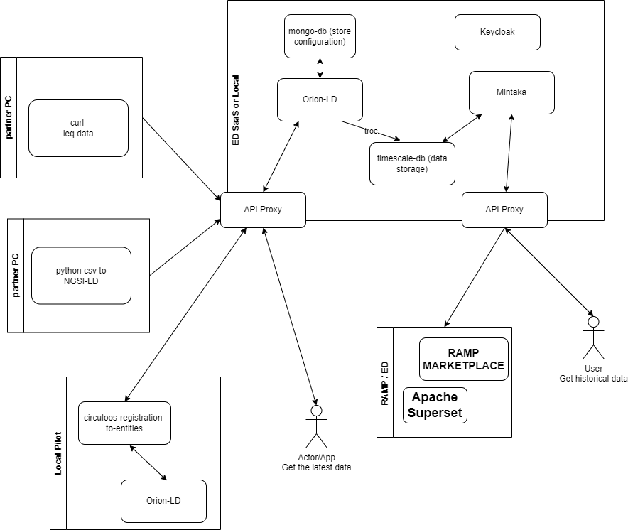

# CIRCULOOS Platform
The CIRCULOOS Platform utilizes a FIWARE installation, designed to be implemented on factory premises. It compatible with the [NGSI-LD](https://www.etsi.org/deliver/etsi_gs/CIM/001_099/009/01.07.01_60/gs_cim009v010701p.pdf) (Next Generation Service Interfaces) specifications. This platform setup serves as a template, equipped with minimal configurations to facilitate a smooth startup. Utilizing [FIWARE generic enablers](https://github.com/FIWARE/catalogue).

## Architecture 
The main components of the circuloos IoT LD platform are:
1. [Orion-LD](https://github.com/FIWARE/context.Orion-LD) as Context Broker.
2. [Mintaka](https://github.com/FIWARE/mintaka) as NGSI-LD temporal retrieval API.
3. [Keycloak](https://www.keycloak.org/) as single sign-on with identity and access management.
4. [Kong](https://github.com/FIWARE/kong-plugins-fiware) as PEP (Policy Enforcement Point) proxy for Orion-LD and Mintaka.




In the [commands_URL](./commands_URL) you can find commands to interact with the CIRCULOIS Platform located on European Dynamics Server, circuloos-platform.eurodyn.com.\
You need to change the centennial that was send to you by email, **PARTNER_USERNAME** and **PARTNER_PASSWORD**.\
Moreover, a Postman collection of the same commands is [HERE](./commands_URL/ED CIRCULOOS Platform.postman_collection.json)\
Please go throu the demo and then try to connect to the ED CIRCULOIS Platform.\
To send **REAL data** from you pilot please chose a unique **NGSILD-Tenant** to ensure proper data separation form other partner data.


# Demo 

The demo have can run on every Linux system. The following tools needs to be installed: ```docker-compose, curl, bash, jq``` 
jq is used for the formatting of the return json from Orion-LD and Mintaka.

## Docker
To run circuloos use: ```./service start``` on the main folder. The first time will need to download all Docker images ~10minutes depending on internet speed. Then open another terminal to [continue](#demo).

The main docker-compose file(docker-compose.yml) include additional compose files for specific services.
1. temporal.yml. Service for Mintaka and TimescaleDB.
2. keycloak.yml. Service for Keycloak and Kong.
3. circuloos_custom_apps.yml The custom service to upload/transform csv to NGSI-LD JSON and send/POST to Orion-LD and leather board outline

**IMPORTANT** all commands can be found on commands folder

## Check Orion and Mintaka are online 
You can use the following commands:
1. ```./getOrionVersion.sh``` : To get the version of the Orion-LD
2. ```./getOrionVersionViaKong.sh``` : To get the version of the Orion-LD using KONG as PEP (Policy Enforcement Point) proxy
3. ```./getMintakaVersion.sh``` : To get the version of the Mintaka
4. ```./getMintakaVersionViaKong.sh``` : To get the version of the Mintaka using KONG as PEP (Policy Enforcement Point) proxy

## Add data to Orion-LD
A simple Indoor Enviromental Quality sensor measurements have been encoding used NGSI-LD JSON ([demo_1_ieq-001_15min.json](./ieq_sensor/demo_1_ieq-001_15min.json)). With the following commands you can send/POST the measurements to the Orion CB.
1. ```./addDataOrion.sh ../ieq_sensor/demo_1_ieq-001.json``` : Add data to the Orion-LD
2. ```./addDataOrionViaKong.sh ../ieq_sensor/demo_1_ieq-001_15min.json``` : Add data to the Orion-LD Orion-LD using KONG as PEP (Policy Enforcement Point) proxy **These will be used for external systems**
3. ```./addDataOrionViaKong.sh ../ieq_sensor/demo_1_ieq-001_30min.json```

## Get the data from Orion-LD
Orion-LD keeps only the latest measurement of each entity.
1. ```./getDataOrionSensors.sh``` : To get the last measurement of the urn:ngsi-ld:circuloos:demo_1:ieq-001. The property "observedAt" should  be "2024-01-11T10:30:07.446000Z"
2. ```./getDataOrionSensorsViaKong.sh``` : To get the last measurement of the urn:ngsi-ld:circuloos:demo_1:ieq-001 using KONG as PEP (Policy Enforcement Point) proxy

## Get the data from Miktana - historical 
1. ```./getDataMintaka.sh``` : To get the historical measurements of the urn:ngsi-ld:circuloos:demo_1:ieq-001.
2. ```./getDataMintakaViaKong.sh``` : Historical measurements of the urn:ngsi-ld:circuloos:demo_1:ieq-001 using KONG as PEP (Policy Enforcement Point) proxy


# CSV to Orion-LD agent
A custom agent have been created to transform a CSV to NGSI-LD entities and send/POST them to the Orion-LD.

1. Create the csv file with the data that you want to add to the Orion-LD. **IMPORTANT** the first 2 columns **MUST BE** id,type. See [csv_NGSILD_Agent/leatherProducts.csv](csv_NGSILD_Agent/leatherProducts.csv) for a csv file with 2 entities. To add timestamp for the data add a column "observedat" with the date time into a ISO8601 format ("2024-01-31T12:03:02Z"), otherwise the timestamp will be set to current date/time.
2. Go to http://localhost:5000, click on "Browre..." to select a csv file. Next click "Upload".
3. Click "Generate NGSI-LD entities". A JSON representation of the NGSI-LD of the csv entities will appear.
4. Click "Post NGSI-LD entities to Orion-LD". The created NGSI-LD JSON will be send to the Orion-LD. A message with the IDs of the send to the Orion-LD will appear. 
5. See the data send to the Orion-LD ```./getDataOrionSensors.sh leather```

# Leather board outline
A simple tool to calculate and transform to coordinates the remaining part of the leather board/sheet for recycling. 

1. Go to the http://localhost:8501
2. Set the outside dimensions (width, height) of the leather board.
3. Upload the image of the leather board. The removed/cut peaces **MUST** be with white colour. See folder [leather_board_outline](./leather_board_outline) for examples.
4. The image, remaining, removed material will appear and statistics will be printed.
5. Click "Download Coordinates of remaining board" to download the coordinates. You can use them on with the previous tool to upload the data to the Orion-LD. See [leather_outline.csv](./leather_board_outline/leather_outline.csv) as example.

