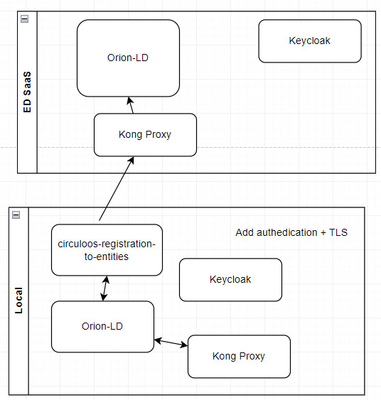

# Federation

If your pilot use a local installation of the CIRCULOOS platform ie Orion-LD, Kong, you will need to set up one or more [FIWARE Subscriptions](https://github.com/FIWARE/tutorials.Subscriptions/tree/NGSI-LD).
With the mechanism of Subscription you can forward automaticaly selected data generated on your local instance to the cental CIRCULOOS platform. A simple registration for all data from a IEQ sensor is [available](./circuloos-registration-to-entities/testing/3.subscribeTo_registration_to_entities.sh) 

The mechanism of registration has power full functionalities like a query:   
- "q": "temperature>20" ie to send the notification **ONLY** when the temperature is above 20.
More information on the official NGSI-LD [documentation](https://www.etsi.org/deliver/etsi_gs/CIM/001_099/009/01.07.01_60/gs_cim009v010701p.pdf)
- "watchedAttributes": ["temperature"] ie to send notification only when the temperature has changed 

To achine the federation without compromising the existing security mechanism, a new service called registrationtoentities. With the above service any notification event generated by the registration on an entity from the local Orion-LD is transformed into a entity for the centralized CIRCULOOS Orion-LD. Additionally the Authedication header is added to the outgoing request.

# Tutorial
All scripts are under folder [testing](./testing/)
1. Verify that the L14 on the [service.sh](./../service.sh) is uncomment ie CIRCULOOS_YML="$CIRCULOOS_YML -f circuloos-registration-to-entities/federation.yml"
2. Update the credentials on [federation.yml](./federation.yml) with the ones that you have received on you email
3. Update the "observedAt" or "value" of any entity in [1.post-ieq-local.sh](./circuloos-registration-to-entities/testing/1.post-ieq-local.sh)
4. Run it  and verify that the local Orion-LD has received the data: [circuloos-registration-to-entities/testing/2.get-ieq-local.sh](./circuloos-registration-to-entities/testing/2.get-ieq-local.sh)
5. Run the subscription [3.subscribeTo_registration_to_entities.sh](./3.subscribeTo_registration_to_entities.sh) and verify that the registration was successful [4.getSubsriptions.sh](./circuloos-registration-to-entities/testing/4.getSubsriptions.sh)
6. Re-run the [1.post-ieq-local.sh](./circuloos-registration-to-entities/testing/1.post-ieq-local.sh)
7. Use the [getDataOrionSensorViaKong.sh](./testing/getDataOrionSensorViaKong.sh) to verify that your data was received by the centralized CIRCULOOS Orion-LD

